# COSC 360 M2 Client Side Experience Report

## Team Members
- Luke Roblesky
- Jacob Harding

## Layout Document
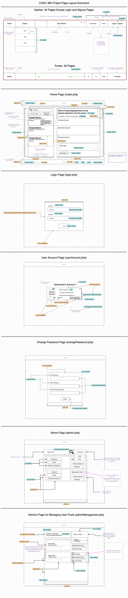

## Organization of Pages - Site Map:
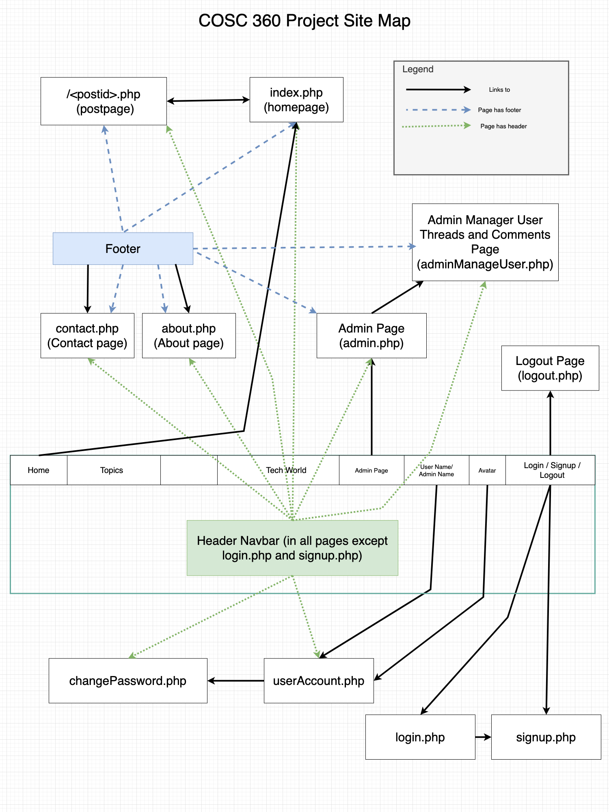

## **Logic Processes:**

The user will find threads on the home page by using the navigation arrow buttons at the bottom of the left column or by searching for the thread through the search bar at the top of the left column. Entering a query in the search bar will update the threads in the left column to be the ones that match the search based on keywords. By default, the list of threads will be populated with those from all topics, but the user can also limit the threads displayed by using the topics dropdown menu in the nav bar. Once the user clicks on a thread card in the left column it will load the corresponding thread and comments into the column on the right of the page. Each post displayed will be linked to a specific url, so that the url of specific thread posts can be saved and located. The change in url will cause the page to refresh, but its layout will remain the same, with the exception of the new thread being loaded in the right column.

The other main way the user will interact with the site is through the top nav bar where there are several buttons. The presentation of the nav bar depends on if the user is logged in, or an administrator:

### **Not Logged in user:**
If the user is not logged in, there will be a login button and a signup button which each redirect to a separate respective page. On the signup page, the user will be presented with four input forms, all of which they must fill in to create a new account. One is a username, which must be unique amongst all other users. Another is an email address. The last two are the user’s password and password confirmation. A successful registration will give feedback to the user indicating that they have successfully created a new account and redirect them back to the main page where it will show their username in the nav bar. Issues with signing up will be indicated on the page, and no redirection will occur. 

### **Logged in as User:**
If the user is logged in, the nav bar will display a logout button, which will change the state of the site to that of a logged out user, and redirect them to the main page if they are not already on it.
When they are logged in, there will also be an account button present on the nav bar, which when clicked will redirect them to their specific account page. On the account page, the account information of the user currently logged in will be displayed, along with a button for editing their account details and profile picture. When they press the button, all the input fields containing their account info will become editable and both a new save and discard button will appear. On pressing the save button, the site will confirm that the changes are valid and have been updated for the user or that there were errors, such as the user tried to change their password, but did not enter their old password correctly.
When the user is logged in and on the main page or a specific thread page, an extra dropdown box will be displayed at the top of the left column and clicking this produces a dropdown menu that allows the threads to be sorted by the the user’s favorites or by recency.

### **Logged in as Admin:**
When the user is logged in as admin, they will have options to manage a thread and the replies within it when they are on that threads page. In the right column where threads are displayed, the top of the thread will have buttons that the admin can press to remove or hide the thread. If the admin removes the thread, they will be redirected back to the home page. If the admin hides the thread, it will change its css style and a caption will be added to show that the thread is hidden so that the admin has feedback. Also a hidden thread will have an unhide button that the admin can press to unhide the thread. 
The search option box at the top of the left column where the threads are listed will display an extra option for the admin to limit the threads to the ones that are hidden. They can then manage these threads more easily. 
Within a thread, the admin will also have buttons for each reply to the thread to either remove or hide the reply. When removing the reply, the reply will disappear and when hiding the reply, the reply will change its css style and a caption will be added saying the reply is hidden. A hidden reply will also have a button added to unhide the reply which when pressed, will remove the hidden reply css styling and hidden caption text.

The admin will also have a page available to them to search for users by username, email, and post title. From this page the admin can change the posting privileges of the user to allowed or not allowed. There will also be a link for each user that matches the admin's search to a page where the admin can manage all the threads and comments of that user, with all the same functionality as described above that the admin can access from the threads themselves.

Similar to a logged in user, the admin will also have an account button on the nav bar which will redirect them to a page where they can edit their account info just like a regular user.

## **Client Side Validation and Security:**
Whenever on the site the user enters and sends form data to the server, client side javascript will be used to reduce the amount of requests with invalid data as well as to check the data as an initial security precaution. One method we will use is built in javascript functions which provide input checking such as the function ‘isNumeric’. One of the other main methods we will use is javascript regular expressions where we will create regular expressions tailored to each type of input. For example, for email inputs a regular expression will be made to ensure the email is in a valid format before sending it to the server. This can be done using the ‘string.search(regex)’ javascript method which can be called for a javascript string. Lastly, when invalid input is given, the submission of the form data will be stopped using the ‘preventDefault()’ function available from the event object passed to events on nodes of the DOM tree.

Communication of invalid form input to the user is important, so we will use javascript/jquery to edit the css styles of the inputs in which the user gave invalid input. This will be done using functions such as ‘addClass’ and ‘removeClass’ which are available in jquery. Messages indicating to the user why the input was invalid will also be dynamically created when invalid input is made, using jquery functions such as ‘text(“invalid input message”)’.

In order to increase site security and prevent brute-force hacking of user credentials, if a user enters their password incorrectly 5 times or more during a 6 hour time window, they will be locked out of the account for 24 hours, the session will be logged and the administrator notified.

## **Discussion Regarding the Design and Styles of All Pages | Static Design and Styles of All Pages:**
### **Fonts**
Barlow was selected as the primary font for our page and imported from Google Fonts. It is advertised as a low-contrast and easy to read font, which makes it ideal for our forum-style website. Here is a sample of what it looks like:
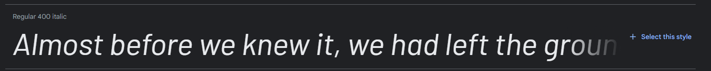

### **Accessibility**
In order to maximize accessibility for all types of users, including those that may be visually impared, html was strictly used for the semantic markup while all styling was applied using Bootstrap and CSS. In accordance with Web Content Accessibility Guidelines, Google Chrome Inspector used while selecting the color palette to ensure that elements maintained a minimum contrast level of 4.5 percent.
(Reference:  https://webaim.org/articles/contrast/) 

### **Navigation and footer bars**
Implemented using a customized bootstrap framework. The “Home”,“Select Topic” and “About” buttons are aligned left, while the site title is centered and “Login,” “Signup,” and social media elements aligned right. Note that bootstrap normally uses relative size measurements, except for container widths in which case pixels are utilized. 
Since this is a bootstrap element it is automatically responsive to different browser sizes and as the width of the viewport is decreased, the bootstrap elements will stack vertically if there is no remaining space.
The navigation bar is present on most of the site’s pages, to allow for easy navigation across the site.
The background color of the navigation bar is the preset bootstrap dark color, used in combination with a white font colour for links for higher contrast for better accessibility and easier reading. We used the built in chrome web tools to check that there was enough contrast between the background colors and font colors of the elements across the site for better accessibility. 
On the navigation bar we also have a dropdown menu which the user can use to select which topic they are browsing threads for. This dropdown menu uses a bluish color with a white font which has also been chosen to have higher contrast for accessibility. For dropdown menus and selection buttons across the site this styling is used for consistency across the site. For buttons which have actions such as submitting a reply to a thread, logging in, or searching for a thread, the same bootstrap dark background color in combination with the white font color as is used in the navigation bar was used.
 
Here is an example of these design decisions on the home page: 
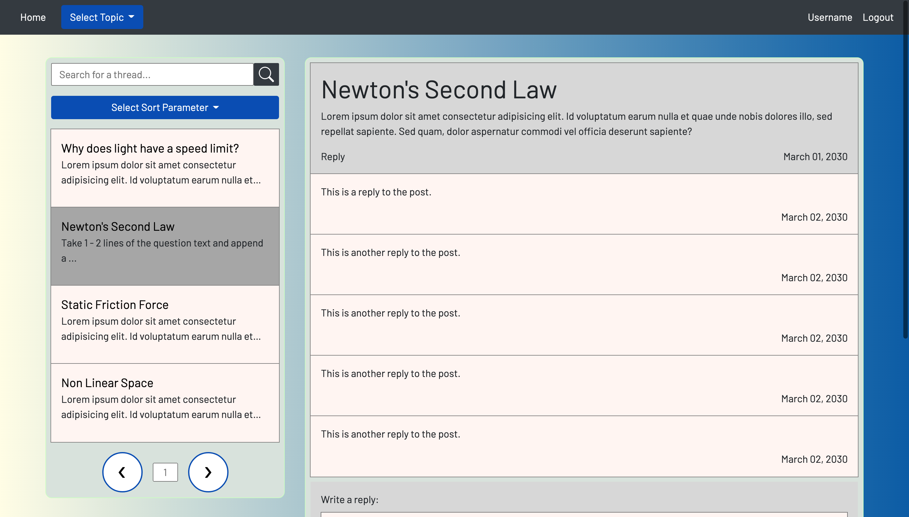

### **Body - Home page**
The background color is a left-to-right linear gradient starting with #FFFDE4 and ending with #005AA7, which helps bring the user’s attention to the page without being too distracting.   
The layout for the home page was designed using a flexbox container with two columns. These two columns are each within a div, contained in a section element. This makes it easy to identify and style each of the two column containers and gives meaning to their semantic markup.
The columns use a slightly greenish background color with a 1px bright green border. A margin of 2em was used between each of the columns and header so that the different sections of the site could be more easily distinguished. The width of the two columns together was set to 90% of the window width so that the most content could be fitted on the screen.

### **Left Column**
At the top of the left container is a search bar for the user to search for threads by keyword.
Below the search bar is a dropdown menu which allows the user to sort the threads by earliest date or latest date (and if we have time, by number of favourites the thread has).
If the user is logged in, there will be another dropdown menu to the right of the other dropdown menu which allows the user to limit the posts to either their personal favourites or all threads.
Below the search option dropdown menus, there is a list of thread ‘cards’ which display the threads that match the user’s search string/options combination. Each thread card displays the thread’s title along with a short snippet of the threads main post text content. 
The search cards use a white background color with a black font color for high contrast, improving the site’s accessibility. Excluding the currently selected thread, hovering over any of the posts changes the element color to yellow, bringing the user’s attention to it.
At the bottom of this container we have two arrow buttons, allowing the user to navigate beyond the first 5 posts, or navigate back towards more recent ones. 

### **Right Column**
The right column takes up 70% of the space that the two columns occupy so that the user can more easily focus on the content that they are reading. The use of percentage widths and heights is used across the site for a flexible ui that adjusts to the user’s browser window. In the right column the main thread title and text is at the top with the title using a larger font size so that the reader can more easily find what the topic of the thread is. The bottom left corner of the main thread card has a reply button for the user to quickly navigate them to the bottom of the column where the reply text input is for the user to write and submit a reply to the thread. The comment cards and main thread title and text each have a date in their bottom right corners. 

### **Other pages**
The other pages on the website using the same color palette and fonts, with slight variations in how the colors are presented. All pages use relative sizing in order to maximize responsiveness.
Here is the bottom of the homepage showing the navigation buttons for the thread posts, the footer and the reply box for submitting replies to a thread:

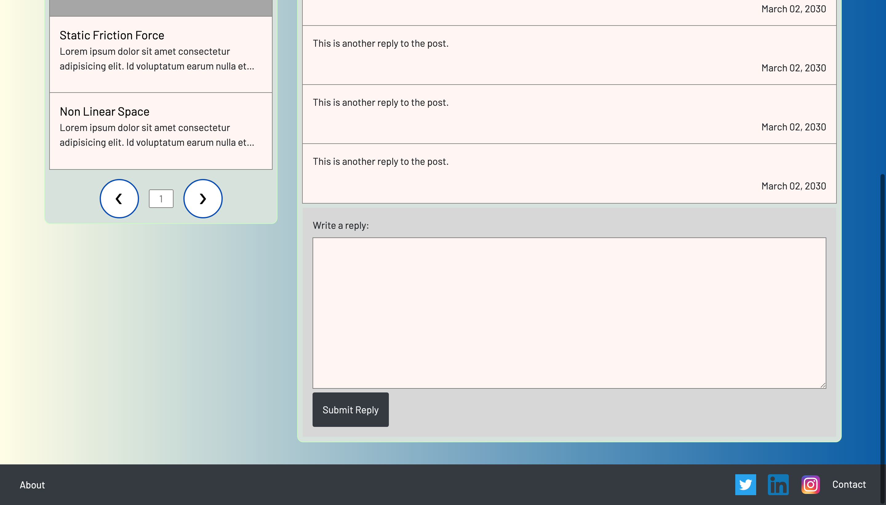

Where space is less scare on other pages, we are using a consistent padding of 2em on all content containers for all pages as is the case here:
Admin page:

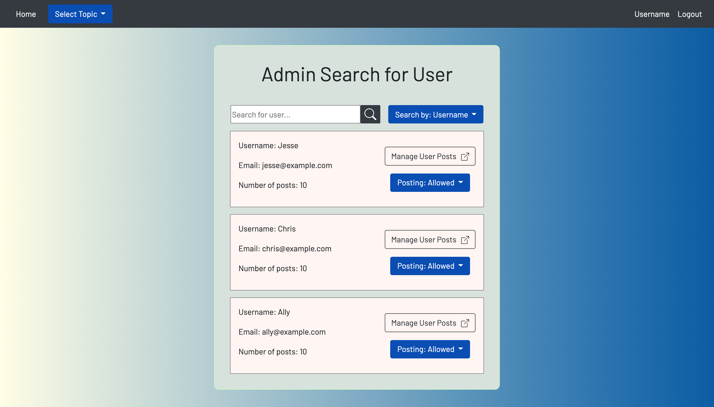

On the page where the admin can manage the posts, distinct large buttons are used to ensure that the wrong action, such as unintended removal of a thread, doesn’t occur.

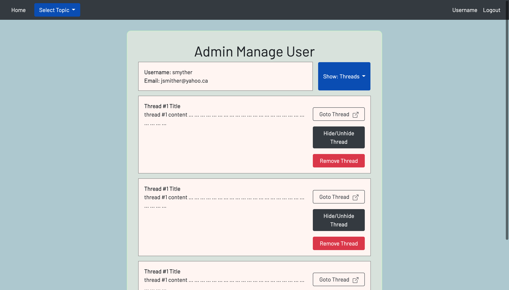

We are also centering all content containers in the middle of the screen using flex boxes: justify-content: center and align-items: center.
Change your password page:

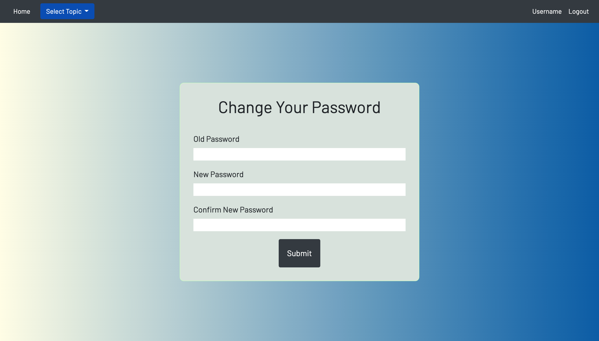

User Profile Page:

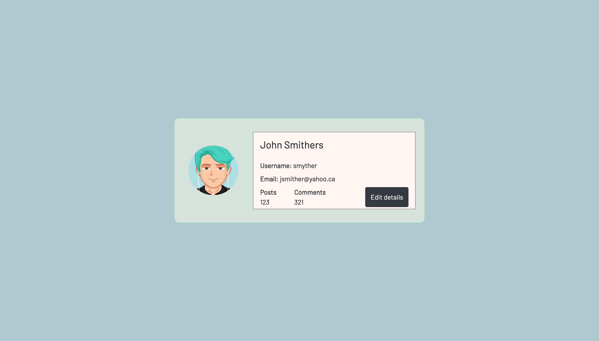

Login page:

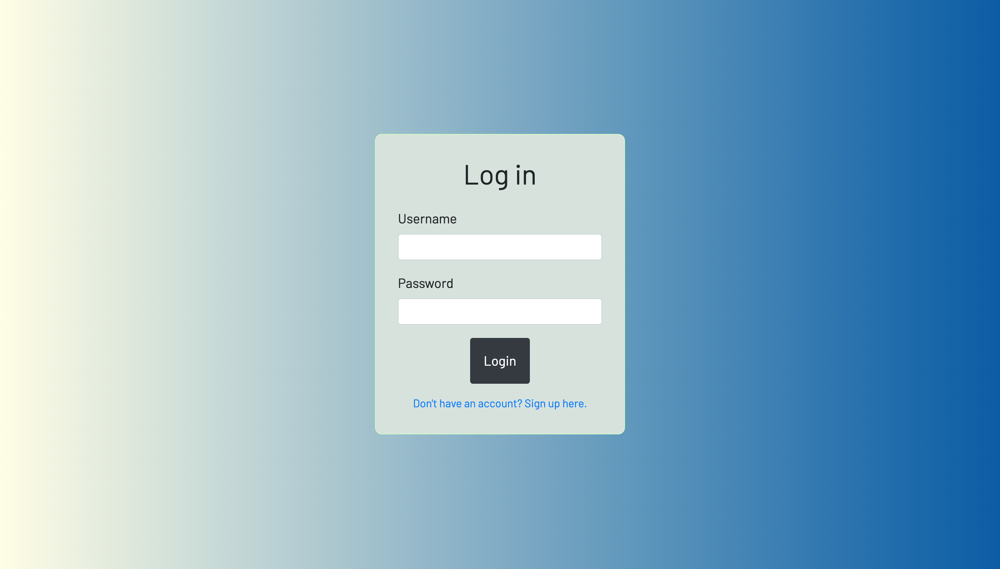

Signup page:

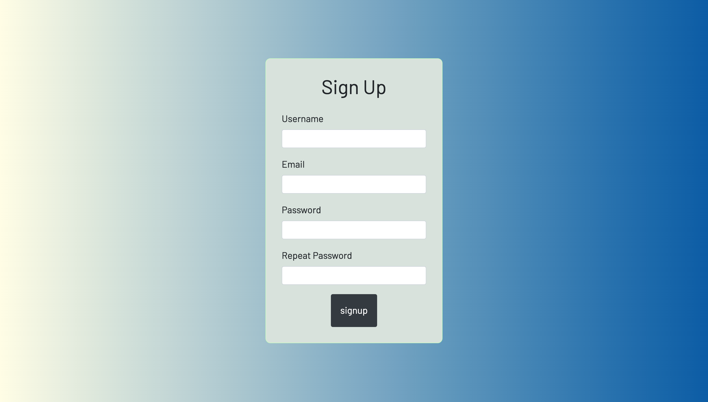
